<div align="center">

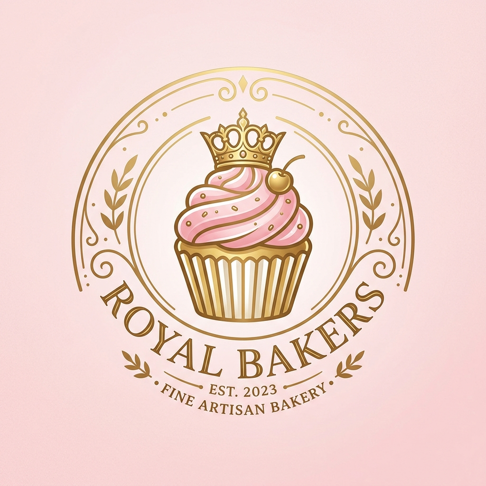

# 🍞 Bakery Management System

### *A Modern Bakery Management System built with ASP.NET Core MVC & SQL Server*

<p align="center">
  
</p>

</div>

---

## 🌟 Overview

Bakery Management System is a modern full-stack web application designed to simplify bakery operations while providing customers with an engaging online shopping experience.

The application enables customers to browse bakery products, customize cakes through an interactive drag-and-drop builder, manage shopping carts, place orders, and receive assistance from an AI-powered customer support assistant.

On the administrative side, it provides a complete dashboard for managing products, categories, users, customer orders, inventory, and order statuses through a secure role-based authentication system.

The project combines clean UI, responsive design, secure authentication, AI integration, and database-driven functionality into one complete bakery solution.

---

## 🚀 Highlights

- 🍞 Modern Bakery-Themed UI
- 🎂 Interactive Drag & Drop Cake Builder
- 🤖 AI Customer Support (Google Gemini)
- 🛒 Shopping Cart & Order Management
- 📦 Inventory & Stock Management
- 👨‍💼 Complete Admin Dashboard
- 🔐 Secure Authentication & Authorization
- 📱 Fully Responsive Design
- ⚡ Built with ASP.NET Core MVC & SQL Server

---

## 🏆 Key Features

| Customer | Admin |
|-----------|-------|
| Email Registration & Login | Secure Admin Login |
| Browse Products | Dashboard Overview |
| Search Products | Manage Products |
| Filter Products | Manage Categories |
| Shopping Cart | Manage Users |
| Place Orders | Manage Orders |
| View Order History | Update Order Status |
| AI Customer Support | Stock Management |
| Custom Cake Builder | Database Management |

---

## 🛠️ Tech Stack

### Backend

- ASP.NET Core MVC
- C#
- Entity Framework Core

### Database

- SQL Server
- SQL Server Management Studio (SSMS)

### Frontend

- HTML5
- CSS3
- Bootstrap 5
- JavaScript

### Artificial Intelligence

- Google Gemini API

### Development Tools

- Visual Studio Code
- SQL Server Management Studio (SSMS)
- Git
- GitHub

---

## 📊 Project Statistics

| Category | Details |
|----------|---------|
| Architecture | MVC |
| Authentication | Session-Based |
| Database | SQL Server |
| AI Integration | Google Gemini |
| Responsive Design | ✅ |
| Admin Dashboard | ✅ |
| Product Management | ✅ |
| Stock Management | ✅ |
| Shopping Cart | ✅ |
| Order Management | ✅ |
| Custom Cake Builder | ✅ |
| AI Customer Support | ✅ |

# 📸 Project Showcase

## 🏠 Home Page

The landing page provides customers with a modern bakery-themed interface featuring promotional banners, featured products, categories, and intuitive navigation. It is designed to create a welcoming first impression while delivering a smooth and responsive user experience across all devices.

<p align="center">
  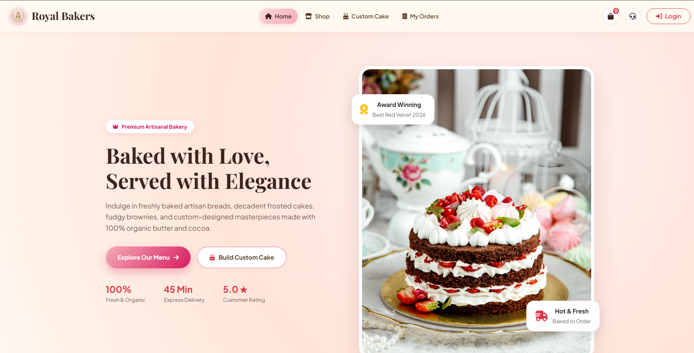
</p>

---

## 🔐 Authentication

The application includes a secure authentication system that allows users to register, log in, and access personalized features such as shopping carts, order history, custom cake orders, and AI customer support.

<p align="center">
  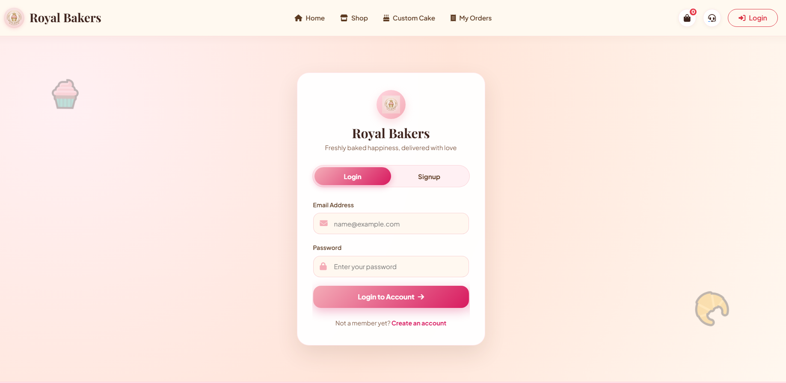
</p>

---

## 🛍️ Shop

Customers can browse a wide range of bakery products with an intuitive shopping experience. The shop includes product search, filtering, detailed product cards, and quick access to add items to the shopping cart.

<p align="center">
  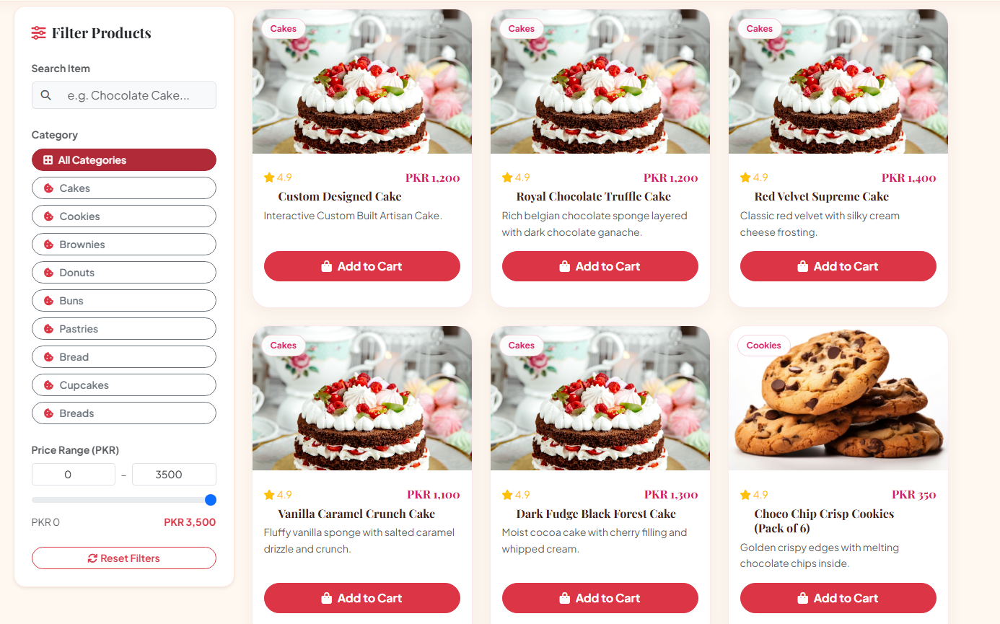
</p>

---

## 🎂 Interactive Cake Builder

One of the standout features of the system is the interactive drag-and-drop Cake Builder. Customers can visually customize cakes by selecting decorations, toppings, and other design elements before placing an order.

<p align="center">
  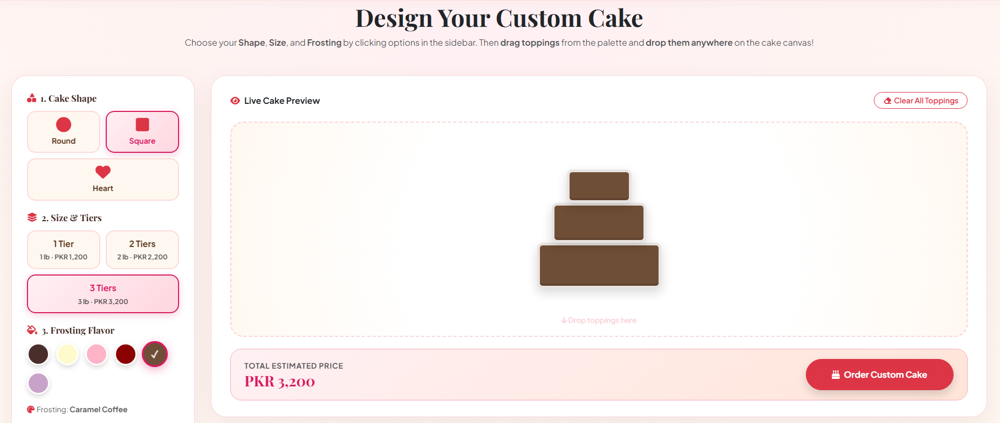
</p>

<p align="center">
  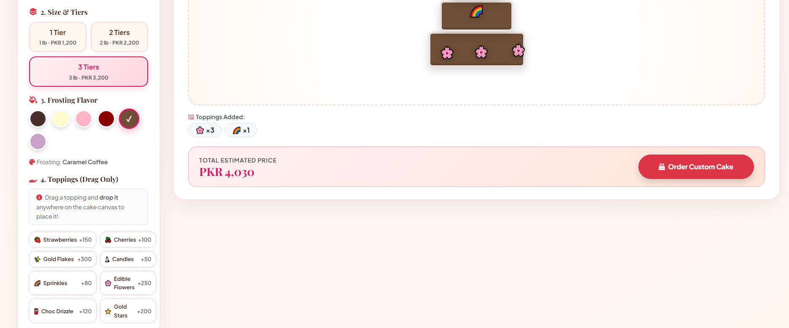
</p>

---

## 🛒 Shopping Cart

The shopping cart provides a simple and user-friendly checkout workflow where customers can review selected products before confirming their order.

<p align="center">
  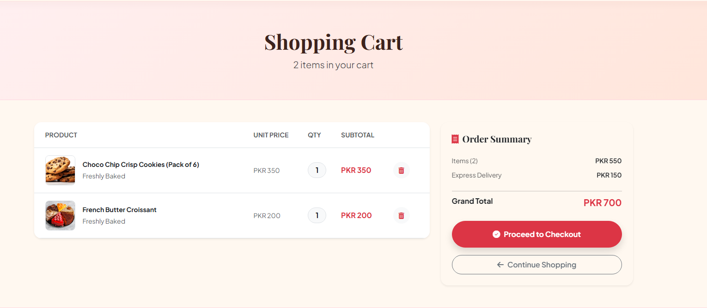
</p>

---

## 📦 My Orders

Customers can access their order history and monitor the progress of each order through different stages including Pending, Confirmed, Preparing, Out for Delivery, Delivered, and Cancelled.

<p align="center">
  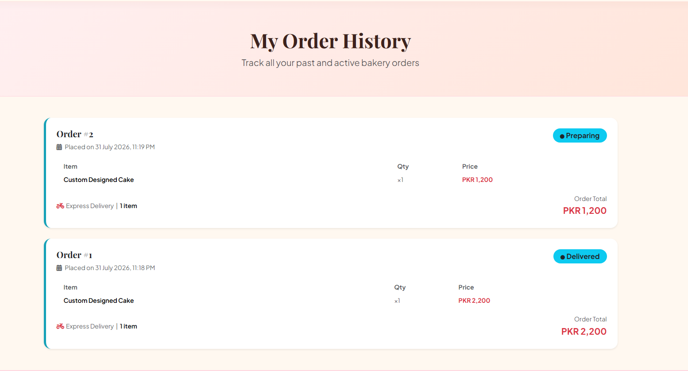
</p>

---

## 🤖 AI Customer Support

The integrated Google Gemini AI chatbot assists customers by answering bakery-related questions, recommending products, and providing helpful guidance throughout the shopping experience.

<p align="center">
  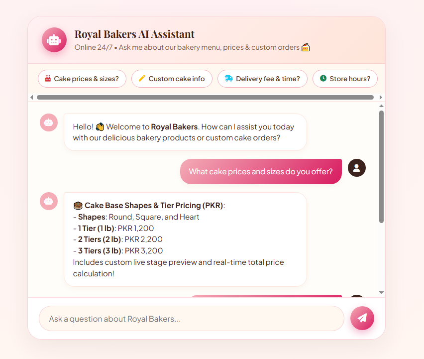
</p>

---

## 👨‍💼 Admin Dashboard

The administrator dashboard provides a centralized overview of bakery operations, allowing administrators to efficiently manage products, users, inventory, and customer orders from one place.

<p align="center">
  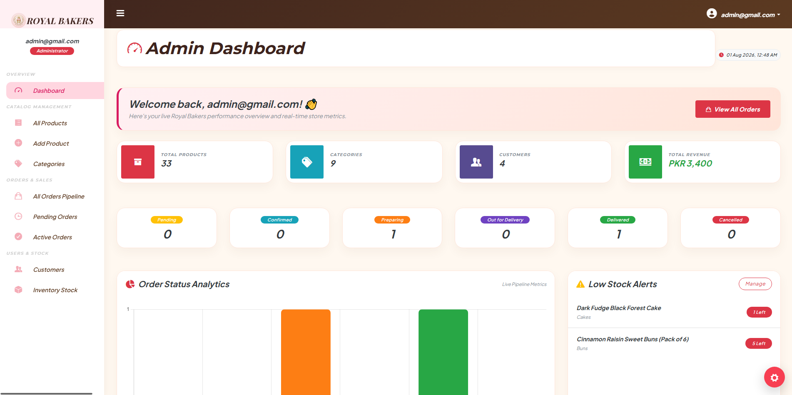
</p>

---

## 📦 Product Management

Administrators can add new products, update existing product information, organize categories, and remove unavailable products through an intuitive management interface.

<p align="center">
  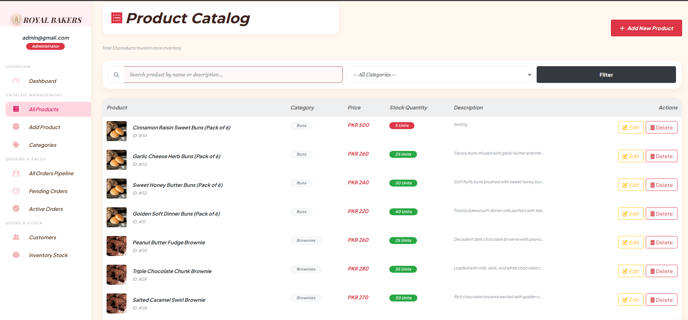
</p>

---

## 📈 Stock Management

The stock management module enables administrators to monitor inventory levels, update stock quantities, and maintain accurate product availability within the bakery.

<p align="center">
  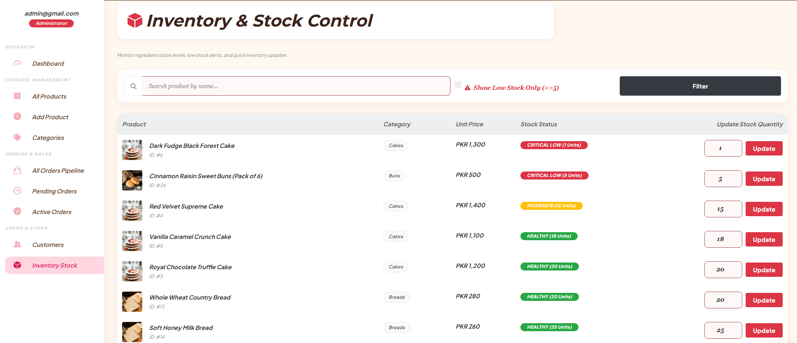
</p>

---

## 🚚 Order Management

Administrators can efficiently manage customer orders by updating their status throughout the complete workflow, including Pending, Confirmed, Preparing, Out for Delivery, Delivered, and Cancelled.

<p align="center">
  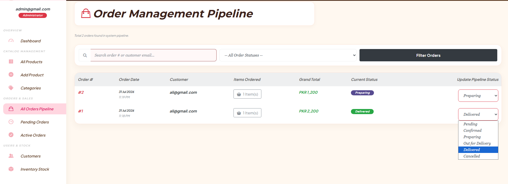
</p>

---

## 🍞 Footer

The footer provides quick navigation links, bakery information, and contact details, ensuring easy access to important pages while maintaining a clean and professional design.

<p align="center">
  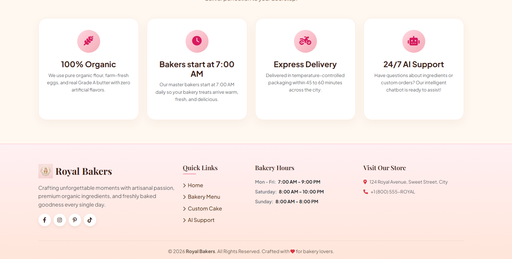
</p>

# 🚀 Getting Started

Follow the steps below to run the project on your local machine.

## 📋 Prerequisites

Make sure you have the following installed:

- Visual Studio 2022 or Visual Studio Code
- .NET 8 SDK (or the version used in this project)
- SQL Server
- SQL Server Management Studio (SSMS)
- Git
- Google Gemini API Key

---

## 📥 Installation

### 1️⃣ Clone the Repository

```bash
git clone https://github.com/codebymustafa/Bakery-Management-System.git
```

### 2️⃣ Navigate to the Project

```bash
cd Bakery-Management-System
```

### 3️⃣ Restore Dependencies

```bash
dotnet restore
```

### 4️⃣ Configure Database

Create a SQL Server database and update the connection string inside:

```text
appsettings.json
```

Example:

```json
"ConnectionStrings": {
  "myconn": "YOUR_CONNECTION_STRING"
}
```

---

### 5️⃣ Configure Google Gemini API

Replace the API key inside:

```text
appsettings.json
```

```json
"GeminiSettings": {
    "ApiKey": "YOUR_API_KEY"
}
```

---

### 6️⃣ Run the Project

```bash
dotnet run
```

or simply press **F5** in Visual Studio.

The application will start on:

```
https://localhost:xxxx
```

---

# 📁 Project Structure

```
Bakery-Management-System
│
├── Controllers/
├── Models/
├── Views/
├── Data/
├── wwwroot/
│   ├── css/
│   ├── js/
│   ├── img/
│   └── modules/
│
├── Properties/
├── Screenshots/
├── Program.cs
├── appsettings.json
├── Bakery_Management_System.csproj
└── README.md
```

---

# 🔐 Security

The following sensitive files should **NOT** contain real credentials before publishing the project.

- API Keys
- Database Connection Strings
- Passwords
- Secret Tokens

Example:

```json
"ConnectionStrings": {
    "myconn": "YOUR_CONNECTION_STRING"
},

"GeminiSettings": {
    "ApiKey": "YOUR_API_KEY"
}
```

Sensitive information has been removed from this repository for security purposes.

---

# 💡 Future Improvements

Some features planned for future versions include:

- 💳 Online Payment Gateway
- 📧 Email Notifications
- 📍 Delivery Address & Contact Information
- ⭐ Product Reviews & Ratings
- ❤️ Wishlist
- 📱 Progressive Web App (PWA)
- 📊 Advanced Dashboard Analytics
- 📈 Sales Reports
- 🔔 Real-Time Notifications
- 🚚 Live Delivery Tracking

---

# 🤝 Contributing

Contributions, suggestions, and feedback are always welcome.

If you'd like to improve this project:

1. Fork the repository.
2. Create a new branch.
3. Commit your changes.
4. Submit a Pull Request.

---

# ⭐ Support

If you found this project helpful, consider giving it a ⭐ on GitHub.

It helps others discover the project and motivates further development.

---

# 👨‍💻 About the Developer

Hi! I'm **M. Mustafa**, a passionate Software Developer focused on building modern, scalable, and user-friendly web applications.

My primary expertise is in the **MERN Stack** and **ASP.NET Core MVC**, with a strong interest in backend development, clean architecture, and AI-powered solutions. I enjoy transforming ideas into real-world applications while continuously learning new technologies and improving my development skills.

This project reflects my journey as a developer and my passion for creating practical software that delivers a great user experience.

---

# 📬 Connect With Me

<p align="center">
  <a href="https://github.com/codebymustafa">
    
  </a>
  &nbsp;&nbsp;&nbsp;&nbsp;
  <a href="mailto:YOUR_EMAIL@gmail.com">
    
  </a>
</p>

---

# 📄 License

This project is available for **educational, learning, and portfolio purposes**.

You're welcome to explore the source code, learn from it, and use it as inspiration. If you reuse significant parts of this project, appropriate credit is appreciated.

---

# 🙌 Credits

This project was built using amazing technologies and open-source tools.

Special thanks to:

- Microsoft & ASP.NET Core Team
- Entity Framework Core
- SQL Server
- Bootstrap
- Google Gemini API
- Visual Studio & Visual Studio Code
- Git & GitHub
- The Open Source Community

Their tools and documentation made the development of this project possible.

---

# ✨ Repository Highlights

- 🚀 ASP.NET Core MVC Architecture
- 🎂 Interactive Drag & Drop Cake Builder
- 🤖 Google Gemini AI Integration
- 🛒 Complete Shopping Cart Workflow
- 📦 Inventory & Stock Management
- 👨‍💼 Admin Dashboard
- 🔐 Authentication & Authorization
- 📱 Fully Responsive Design
- 🗄️ SQL Server Database
- 💼 Portfolio-Ready Project

---

# 🌟 Enjoyed This Project?

If you found this repository helpful or interesting, consider giving it a **⭐ Star**.

It helps others discover the project and motivates me to keep building and sharing more projects.

---

<div align="center">

## 🍞 Thanks for Stopping By!

### Built & Designed by **M. Mustafa**

#### 🚀 See you in the next project.

</div>